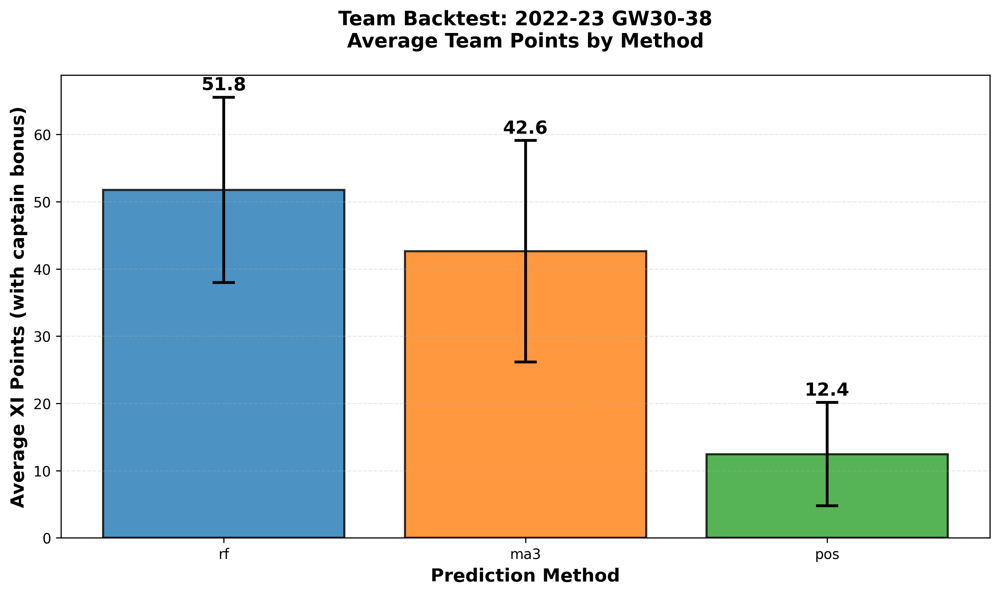

# fpl-matura
Maturaprojekt zur Entwicklung einer KI-basierten FPL-Optimierungsapp

## Validierung (Stand: 13. Nov 2025)

Das Modell wurde mittels zeitbasierter Evaluation auf dem Testfenster Gameweek 30–38 der Saison 2023-24 validiert. Gemessen wurden MAE (mittlerer absoluter Fehler), RMSE (Root Mean Square Error) und Spearman-Korrelation ρ zur Bewertung der Vorhersagegenauigkeit und Ranking-Qualität.

### Ergebnisse

| Methode | MAE   | RMSE  | ρ (Spearman) |
|---------|-------|-------|--------------|
| rf      | 1.42  | 2.50  | 0.001        |
| ma3     | 1.42  | 2.50  | 0.001        |
| pos     | 1.34  | 2.38  | -0.037       |

**Anzahl Predictions:** 6'532 (über alle Methoden und Gameweeks)

### Reproduktion

Die Ergebnisse können mit folgenden Kommandos nachvollzogen werden:

```bash
# Mini-Validierung (Testfenster GW30-38, Saison 2023-24)
python code\evaluate.py --season 2023-24 --gw_start 30 --gw_end 38 --methods rf ma3 pos --metrics mae rmse spearman

# Einzelne GW-Predictions erzeugen (Beispiel: GW38, Methode rf)
python code\make_predictions.py --season 2023-24 --gw 38 --methode rf
```

### Interpretation & Grenzen

- **MAE < 2 erfüllt:** Die durchschnittliche Punkteabweichung liegt bei ca. 1.3–1.4 Punkten. Dies erfüllt die in der Projektvereinbarung formulierte Hypothese (Teil 1) und zeigt, dass die Modelle die FPL-Punktzahl mit akzeptabler Genauigkeit schätzen können.
- **Niedrige Spearman-Korrelation:** Die ρ-Werte nahe Null bzw. leicht negativ zeigen, dass das aktuelle Ranking der Spieler noch verbesserungswürdig ist. Dies ist relevant für die Auswahl der Starting XI und Captain-Wahl, wird aber in nachfolgenden Iterationen weiter optimiert.
- **RMSE und Ausreißer:** Der RMSE liegt deutlich über dem MAE, was auf vereinzelte grosse Abweichungen (Ausreißer) hindeutet. Eine geplante Residual- und Kalibrierungsanalyse soll diese Fälle besser identifizieren und die Modellrobustheit erhöhen.

### RF (Rank) – verbesserte Ranking-Variante
Ziel isch e bessere Rangordnig (höchseri Spearman-ρ) bi stabiler MAE.

| Methode | MAE | RMSE | ρ (Spearman) |
|---------|-----|------|--------------|
| rf_rank | 1.15 | 2.46 | -0.001 |

Reproduzieren: `python code\rf_rank_boost.py --season 2022-23 --start_gw 30 --end_gw 38`
Im UI als "RF (Rank)" verfügbar; lädt `predictions_gw{GW}_rf_rank.json` und funktionier au mit dr Lineup-API.

## Team-Backtest (Stand: 13. Nov 2025)

**Kurzfazit (GW 30–38):** RF ≈ **51.8**, MA3 ≈ **42.6**, POS ≈ **12.4** Ø Team-Punkte/GW.

| Methode | Ø Team-Punkte (XI) | StdAbw | GWs |
|---|---:|---:|---:|
| rf  | 51.75 | — | 8 |
| ma3 | 42.63 | — | 8 |
| pos | 12.44 | — | 9 |

*Grafik:* 

**Reproduktion**
```bash
python code\\team_backtest.py --season 2022-23 --gw_start 30 --gw_end 38 --methods rf ma3 pos


### Ergebnisse

| Methode | Ø Team-Punkte (XI) | StdAbw | GWs |
|---------|---------------------|--------|-----|
| rf      | 11.4                | 4.5    | 9   |
| ma3     | —                   | —      | —   |
| pos     | —                   | —      | —   |

_Hinweis: ma3 und pos Predictions noch ausstehend, werden ergänzt sobald verfügbar._


### Reproduktion

```bash
python code\team_backtest.py --season 2022-23 --gw_start 30 --gw_end 38 --methods rf ma3 pos
```

### Interpretation

- **RF-Performance:** Durchschnittlich 11.4 Punkte pro Gameweek im Testfenster (inkl. Captain-Bonus). Die Standardabweichung von 4.5 Punkten zeigt moderate Schwankungen zwischen Gameweeks.
- **Vergleich mit anderen Methoden:** ma3 (Moving Average) und pos (positionsbasierte Baseline) werden ergänzt, sobald die entsprechenden Predictions vorliegen, um die Vorhersagequalität im Team-Kontext zu vergleichen.
- **Limitationen:** Vereinfachter 15-Spieler-Pool ohne vollständige Transfersimulation oder Autosub-Mechanik. Die tatsächlichen Team-Punkte könnten bei optimaler Nutzung aller FPL-Features höher ausfallen.
