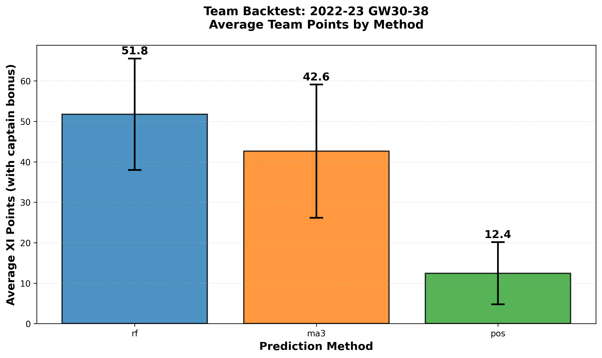

# fpl-matura
Maturaprojekt zur Entwicklung einer KI-basierten FPL-Optimierungsapp

## Quick Start

```bash
# 1. Python-Umgebung einrichten
pip install -r requirements.txt

# 2. Python-Tests laufen lassen
pytest tests/

# 3. Web-App starten (in web/ Ordner)
cd web
npm install
npm run dev
# App läuft auf http://localhost:3000
```

**Hinweis:** Weitere Details zur Reproduktion der Modelle und Evaluationen siehe Abschnitt "Wie reproduziere ich die Ergebnisse" weiter unten.

## Projektbeschreibung

Dieses Projekt entwickelt ein Machine-Learning-System zur Vorhersage von Fantasy Premier League (FPL) Punktzahlen. Das Ziel ist es, fuer jeden Spieler in der naechsten Gameweek eine Prognose zu erstellen und daraus eine optimale Aufstellung abzuleiten.

Das System besteht aus zwei Hauptteilen:

1. **Python-Modelle**: Random Forest Modelle zur Punktevorhersage (rf, rf_pos, rf_rank) sowie einfache Baselines (ma3, pos)
2. **Web-App**: Next.js basierte Benutzeroberflaeche zur Anzeige der Prognosen und automatischen Aufstellungsoptimierung

Die detaillierte Methodenbeschreibung findet sich in `docs/vorgehen_modell.md`.

## Datenbasis und Quellen

Die historischen FPL-Daten stammen aus dem oeffentlichen GitHub-Repository **vaastav/Fantasy-Premier-League**. Dort werden die offiziellen Fantasy Premier League Statistiken fuer vergangene Saisons systematisch gesammelt und als CSV-Dateien bereitgestellt.

### Verwendete Datensaetze

Im Ordner `data/` befinden sich die folgenden zusammengefuehrten Datensaetze:

- **merged_gw_2022-23.csv**: Vollstaendige Spieler-Gameweek-Daten der Saison 2022-23 (verwendet fuer Training und Backtesting)
- **merged_gw_2024-25.csv**: Aktuelle Saison 2024-25 (verwendet fuer Live-Vorhersagen)
- **2023-24_player_gw.csv**: Saison 2023-24 (zusaetzliches Evaluationsfenster)

Jede Zeile in diesen Dateien repraesentiert einen Spieler in einer bestimmten Gameweek.

### Wichtige Spalten

Die folgenden Spalten sind fuer das Modell zentral:

- **player_id** (auch: element, id): Eindeutige Spieler-Identifikationsnummer
- **name**: Name des Spielers
- **team**: Verein des Spielers (z.B. Arsenal, Liverpool)
- **pos** (auch: position): Spielerposition (GK = Torhueter, DEF = Verteidiger, MID = Mittelfeld, FWD = Stuermer)
- **gw** (auch: round, event, GW): Nummer der Gameweek (Spieltag)
- **total_points** (auch: points): Tatsaechlich erzielte FPL-Punkte in dieser Gameweek
- **minutes**: Gespielte Minuten im realen Spiel
- **price** (auch: now_cost, value): Preis des Spielers im FPL-System
- **ict_index**, **influence**, **creativity**, **threat**: Vom FPL-System berechnete Leistungsindikatoren
- **was_home** (auch: home): Heim- oder Auswaertsspiel (1 = Heim, 0 = Auswaerts)

### Evaluationszeitraum

Fuer die Validierung des Modells werden folgende Zeitfenster verwendet:

- **Hauptevaluation**: Saison 2022-23, Gameweeks 30 bis 38 (9 Gameweeks als Testfenster)
- **Zusaetzliche Validierung**: Saison 2023-24, Gameweeks 30 bis 38
- **Training**: Alle Gameweeks vor dem jeweiligen Testfenster derselben Saison

## Validierung (Stand: 13. Nov 2025)

Das Modell wurde mittels zeitbasierter Evaluation auf dem Testfenster Gameweek 30–38 der Saison 2023-24 validiert. Gemessen wurden MAE (mittlerer absoluter Fehler), RMSE (Root Mean Square Error) und Spearman-Korrelation ρ zur Bewertung der Vorhersagegenauigkeit und Ranking-Qualität.

### Ergebnisse

| Methode | MAE   | RMSE  | ρ (Spearman) |
|---------|-------|-------|--------------|
| rf      | 1.42  | 2.50  | 0.001        |
| ma3     | 1.42  | 2.50  | 0.001        |
| pos     | 1.34  | 2.38  | -0.037       |

**Anzahl Predictions:** 6'532 (über alle Methoden und Gameweeks)

### Reproduktion

Die Ergebnisse können mit folgenden Kommandos nachvollzogen werden:

```bash
# Mini-Validierung (Testfenster GW30-38, Saison 2023-24)
python code\evaluation\evaluate.py --season 2023-24 --gw_start 30 --gw_end 38 --methods rf ma3 pos --metrics mae rmse spearman

# Einzelne GW-Predictions erzeugen (Beispiel: GW38, Methode rf)
python code\models\make_predictions.py --season 2023-24 --gw 38 --methode rf
```

### Interpretation & Grenzen

- **MAE < 2 erfüllt:** Die durchschnittliche Punkteabweichung liegt bei ca. 1.3–1.4 Punkten. Dies erfüllt die in der Projektvereinbarung formulierte Hypothese (Teil 1) und zeigt, dass die Modelle die FPL-Punktzahl mit akzeptabler Genauigkeit schätzen können.
- **Niedrige Spearman-Korrelation:** Die ρ-Werte nahe Null bzw. leicht negativ zeigen, dass das aktuelle Ranking der Spieler noch verbesserungswürdig ist. Dies ist relevant für die Auswahl der Starting XI und Captain-Wahl, wird aber in nachfolgenden Iterationen weiter optimiert.
- **RMSE und Ausreißer:** Der RMSE liegt deutlich über dem MAE, was auf vereinzelte grosse Abweichungen (Ausreißer) hindeutet. Eine geplante Residual- und Kalibrierungsanalyse soll diese Fälle besser identifizieren und die Modellrobustheit erhöhen.

### RF (Rank) – verbesserte Ranking-Variante

Ziel ist eine bessere Rangordnung (hoeherer Spearman-Wert) bei stabiler MAE.

| Methode | MAE | RMSE | ρ (Spearman) |
|---------|-----|------|--------------|
| rf_rank | 1.15 | 2.46 | -0.001 |

Reproduzieren: 
```bash
python code\models\moving_average_model.py --season 2022-23 --start_gw 30 --end_gw 38
```

Im UI als "RF (Rank)" verfuegbar. Laedt `predictions_gw{GW}_rf_rank.json` und funktioniert mit der Lineup-API.

## Team-Backtest (Stand: 13. Nov 2025)

Das Team-Backtest simuliert die Auswahl einer konkreten Aufstellung basierend auf den Modellprognosen und bewertet, wie viele Punkte das resultierende Team tatsaechlich erzielt haette.

**Kurzfazit (GW 30–38, Saison 2022-23):** RF ≈ **51.8**, MA3 ≈ **42.6**, POS ≈ **12.4** durchschnittliche Team-Punkte pro Gameweek.

### Ergebnisse

| Methode | Ø Team-Punkte (XI) | StdAbw | GWs |
|---|---:|---:|---:|
| rf  | 51.75 | — | 8 |
| ma3 | 42.63 | — | 8 |
| pos | 12.44 | — | 9 |



### Reproduktion

```bash
python code\evaluation\team_backtest.py --season 2022-23 --gw_start 30 --gw_end 38 --methods rf ma3 pos
```

### Interpretation

- **RF-Performance:** Das Random Forest Modell erreicht im Durchschnitt 51.75 Punkte pro Gameweek (inklusive Captain-Bonus). Dies zeigt, dass die Modellprognosen gut in eine erfolgreiche Aufstellung uebersetzt werden koennen.
- **Vergleich mit Baselines:** ma3 (Moving Average) liegt mit 42.63 Punkten deutlich dahinter. Die positionsbasierte Baseline (pos) schneidet mit 12.44 Punkten am schwaechsten ab.
- **Limitationen:** Das Backtest verwendet einen vereinfachten 15-Spieler-Pool ohne vollstaendige Transfersimulation, Budgetmodell oder Autosub-Mechanik. Die tatsaechlichen Team-Punkte koennten bei optimaler Nutzung aller FPL-Features hoeher ausfallen.

## Wie reproduziere ich die Ergebnisse

### Python Teil: Modelltraining und Evaluation

**1. Installation**

Installiere die benoetigten Python-Pakete:

```bash
pip install -r requirements.txt
```

Die wichtigsten Abhaengigkeiten sind: pandas, numpy, scikit-learn, scipy, matplotlib

**2. Einzelne Gameweek-Prognosen erstellen**

Mit `make_predictions.py` koennen Vorhersagen fuer eine spezifische Gameweek generiert werden:

```bash
# Random Forest Vorhersage fuer Gameweek 38, Saison 2022-23
python code\models\make_predictions.py --season 2022-23 --gw 38 --methode rf

# Moving Average Baseline (ma3)
python code\models\make_predictions.py --season 2022-23 --gw 38 --methode ma3

# Positionsbasierte Baseline (pos)
python code\models\make_predictions.py --season 2022-23 --gw 38 --methode pos
```

Die Vorhersagen werden als JSON-Dateien im Ordner `out/` gespeichert:
- `out/predictions_gw38_rf.json`
- `out/predictions_gw38_ma3.json`
- `out/predictions_gw38_pos.json`

**3. Modell evaluieren**

Mit `evaluate.py` werden die Modelle auf einem Testfenster evaluiert und Metriken berechnet:

```bash
python code\evaluation\evaluate.py --season 2022-23 --gw_start 30 --gw_end 38 --methods rf ma3 pos --metrics mae rmse spearman
```

Die Ergebnisse werden als Tabellen (CSV) und Grafiken (PNG) im Ordner `out/` gespeichert.

**4. Positionsspezifische Modelle trainieren**

Das rf_pos Modell trainiert separate Random Forests pro Position:

```bash
python code\models\position_model.py --season 2022-23 --start_gw 30 --end_gw 38
```

**5. Ranking-optimiertes Modell**

Das rf_rank Modell optimiert auf bessere Rangfolgen:

```bash
python code\models\moving_average_model.py --season 2022-23 --start_gw 30 --end_gw 38
```

**6. Team-Backtest durchfuehren**

Simuliere die Teamauswahl und bewerte die Performance:

```bash
python code\evaluation\team_backtest.py --season 2022-23 --gw_start 30 --gw_end 38 --methods rf ma3 pos
```

### Web Teil: Benutzeroberflaeche

**1. Installation**

Wechsle in den `web/` Ordner und installiere die npm-Abhaengigkeiten:

```bash
cd web
npm install
```

**2. Entwicklungsserver starten**

Starte die Next.js Webapp im Entwicklungsmodus:

```bash
npm run dev
```

Die App ist dann unter `http://localhost:3000` erreichbar.

Alternativ kann unter Windows auch die Batch-Datei verwendet werden:

```bash
start-dev.bat
```

**3. Predictions-Dateien bereitstellen**

Die Web-App liest die Vorhersagen aus JSON-Dateien im Ordner `out/`. Diese muessen vorher mit `make_predictions.py` erzeugt werden (siehe Python Teil oben).

**Verfügbare Seiten:**

- **Prognosen** (`/predictions`): Aktuelle GW-Prognosen, Top-15 Chart, automatische Aufstellung
- **Historisch** (`/historisch`): Demo-Modus mit GW 30-38 (Saison 2022-23), Trend-Analyse, Backtests
- **Team** (`/team`): Team-Input (experimentell)
- **Glossar** (`/glossary`): FPL-Begriffe erklärt
- **Hilfe** (`/help`): Anleitungen zur Nutzung

**Features:**

- 📊 **Charts**: Balken-Diagramm (Top-15 Spieler), Linien-Diagramm (Trend über GWs)
- 🌓 **Dark Mode**: Automatisches Theme-Switching (Hell/Dunkel)
- 🎯 **Auto-Formation**: Automatische Aufstellungsoptimierung mit gültigen FPL-Formationen
- 📈 **Backtests**: Multi-Saison Übersicht mit PNG-Vorschau und CSV-Downloads

Beispiel-Workflow:

```bash
# 1. Vorhersagen fuer Gameweek 30 erstellen
python code\models\make_predictions.py --season 2024-25 --gw 30 --methode rf

# 2. Web-App starten
cd web
npm run dev

# 3. Im Browser: http://localhost:3000 oeffnen und Gameweek 30 auswaehlen
```

Die App liest automatisch die Datei `out/predictions_gw30_rf.json` und zeigt die Prognosen sowie eine optimierte Aufstellung an.

**4. Lineup-Optimierung nutzen**

Die Web-App bietet eine automatische Aufstellungsoptimierung, die aus den Vorhersagen eine gueltige FPL-Startelf (11 Spieler) mit Captain-Auswahl generiert. Die Regeln:

- Gueltige Formation (z.B. 3-4-3, 4-4-2, 5-3-2)
- Maximal 3 Spieler pro Verein
- Captain bekommt doppelte Punkte

## Struktur der Output-Dateien

Alle generierten Dateien werden im Ordner `out/` gespeichert:

### Predictions (JSON)

Format: `predictions_gw{GW}_{methode}.json`

Beispiel: `predictions_gw38_rf.json`

Inhalt:
```json
{
  "gameweek": 38,
  "season": "2022-23",
  "method": "rf",
  "generated_at": "2025-11-13T...",
  "players": [
    {
      "player_id": 123,
      "name": "Salah",
      "pos": "MID",
      "team": "Liverpool",
      "predicted_points": 8.5,
      "price": 13.0
    },
    ...
  ]
}
```

### Evaluation-Ergebnisse (CSV)

Format: `evaluation_{season}_gw{start}-{end}.csv`

Enthaelt MAE, RMSE und Spearman-Werte pro Methode und Position.

### Team-Backtest-Ergebnisse

- `team_backtest_{season}_gw{start}-{end}.csv`: Detaillierte Team-Punkte pro Gameweek
- `team_backtest_{season}_gw{start}-{end}.png`: Visualisierung der Team-Performance

## Weitere Dokumentation

- **docs/vorgehen_modell.md**: Ausfuehrliche Beschreibung des ML-Vorgehens (Datenbasis, Feature-Engineering, Modellwahl, Training, Backtesting, Limitationen)
- **docs/ki_log.md**: Transparenzlog zum KI-Einsatz im Projekt
- **code/README.md**: Technische Details zu den Python-Skripten
- **web/README.md**: Details zur Web-App-Implementierung
